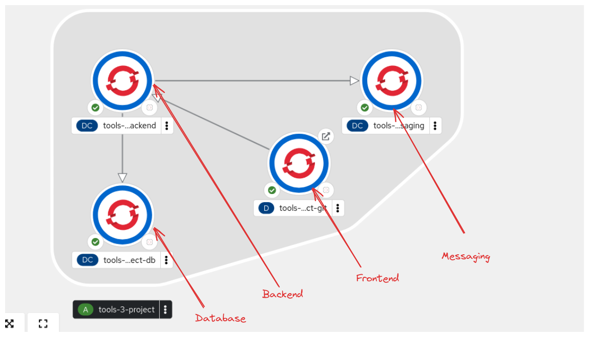
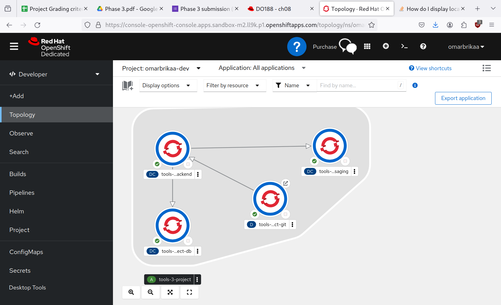
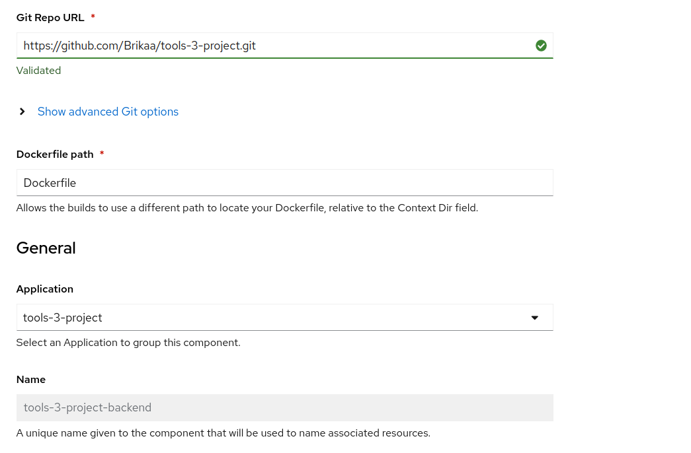
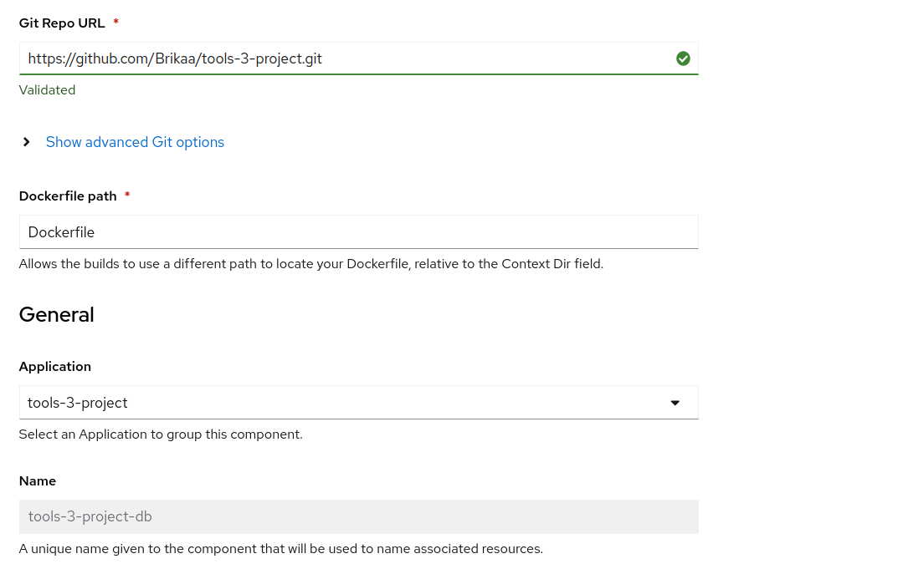
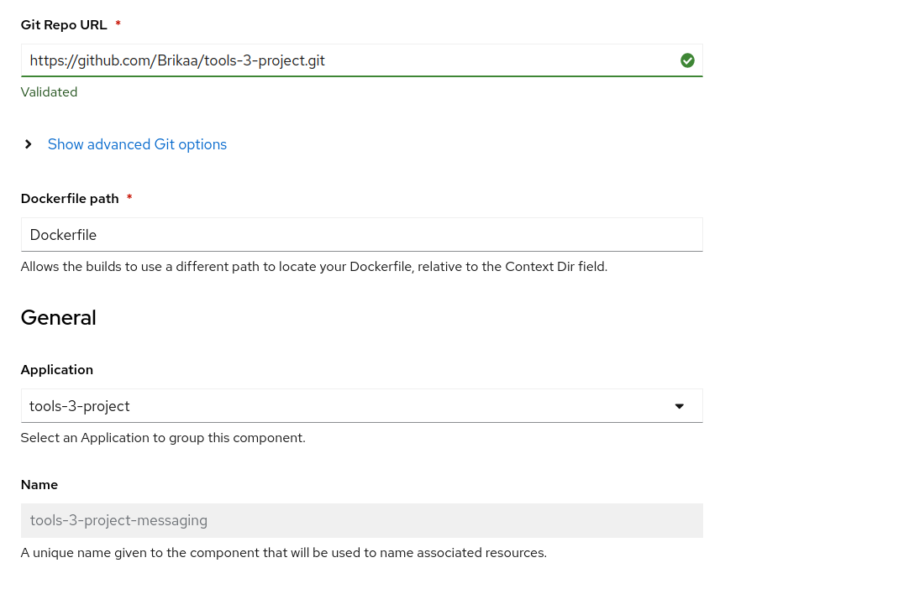
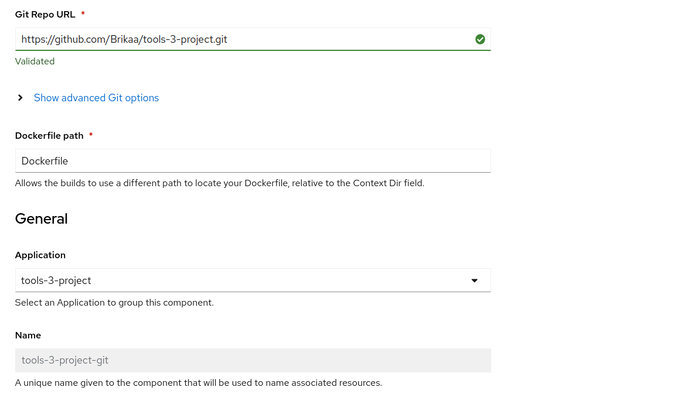

# Connection between app layers on Openshift

# GitHub repo used in deployment (each one uses the appropriate directory containing the Dockerfile)

## Backend

## Database

## Messaging

## Frontend

